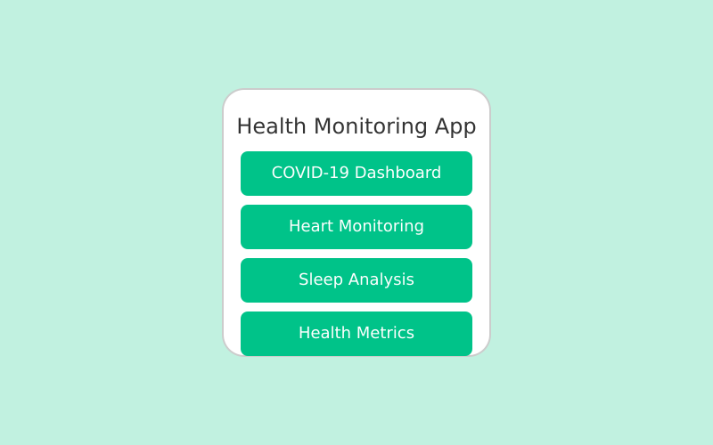

# Health Monitoring App

A responsive health monitoring application built with HTML, CSS, and JavaScript that provides comprehensive health tracking features. This application offers a user-friendly interface for monitoring various health metrics including COVID-19 statistics, heart rate data, sleep patterns, doctor information, health articles, and personal health metrics.



## 📱 Features

### Dashboard
- Overview of all available health monitoring modules
- Quick access to all sections of the application

### COVID-19 Tracking
- Real-time COVID-19 case statistics
- Country-specific data visualization
- Vaccination information and news updates
- Tabbed interface for different COVID-related data

### Heart Rate Monitoring
- Visualization of heart rate metrics
- Heart rate variability tracking
- Pulse and average heart rate monitoring
- Daily, weekly, and monthly data views

### Sleep Analysis
- Sleep duration and quality tracking
- Time in bed vs. actual sleep time metrics
- Weekly sleep pattern visualization
- Sleep schedule monitoring

### Doctor Directory
- Browse doctors by specialty
- View doctor ratings and availability
- Filter options for finding specialists
- Contact and appointment scheduling options

### Health Articles
- Curated health and wellness articles
- Categorized content for easy navigation
- Featured articles section
- Reading time estimates for each article

### Health Metrics Dashboard
- Comprehensive health metrics tracking
- Daily steps, water intake, calories burned
- Progress tracking against daily goals
- Trend indicators for each health metric

### User Profile
- Personal and medical information management
- Allergies and medication tracking
- Quick access to medical records and appointments
- Profile customization options

## 🛠️ Technology Stack

- **Frontend**: 
  - HTML5
  - CSS3 
  - Vanilla JavaScript
  - Material Icons
  - Google Fonts

- **Backend**:
  - Node.js
  - Express.js

## 📋 Project Structure

```
health-monitoring-app/
├── index.html          # Main HTML file
├── styles.css          # CSS styles
├── app.js              # Main JavaScript application logic
├── data.js             # Data models and sample data
├── server/             # Backend server files
└── README.md           # Project documentation
```

## 🚀 Getting Started

### Prerequisites

- Node.js (v14 or higher)
- npm (v6 or higher)

### Installation

1. Clone the repository:
   ```
   git clone https://github.com/yourusername/health-monitoring-app.git
   cd health-monitoring-app
   ```

2. Install dependencies:
   ```
   npm install
   ```

3. Start the application:
   ```
   npm run dev
   ```

4. Open your browser and navigate to:
   ```
   http://localhost:5000
   ```

## 📊 Data Handling

This application uses sample data for demonstration purposes. In a production environment, you would integrate with:

- Health tracking APIs
- Electronic Health Record (EHR) systems
- Wearable device APIs (Apple Health, Google Fit, Fitbit, etc.)
- COVID-19 data providers

## 🎨 UI/UX Design

The application features a clean, modern UI with:

- Responsive design for all device sizes
- Mobile-first approach
- Intuitive navigation
- Consistent color scheme
- Accessible interface

## 🔄 Future Enhancements

- User authentication and data persistence
- Integration with real-time health tracking APIs
- Push notifications for health alerts
- Customizable dashboards
- Export health data reports
- Dark mode support

## 📝 License

This project is licensed under the MIT License - see the LICENSE file for details.

## 👥 Contributors

- [Your Name](https://github.com/yourusername)

## 🙏 Acknowledgements

- [Material Icons](https://fonts.google.com/icons)
- [Google Fonts](https://fonts.google.com/)
- [COVID-19 Data Sources](https://example.com)